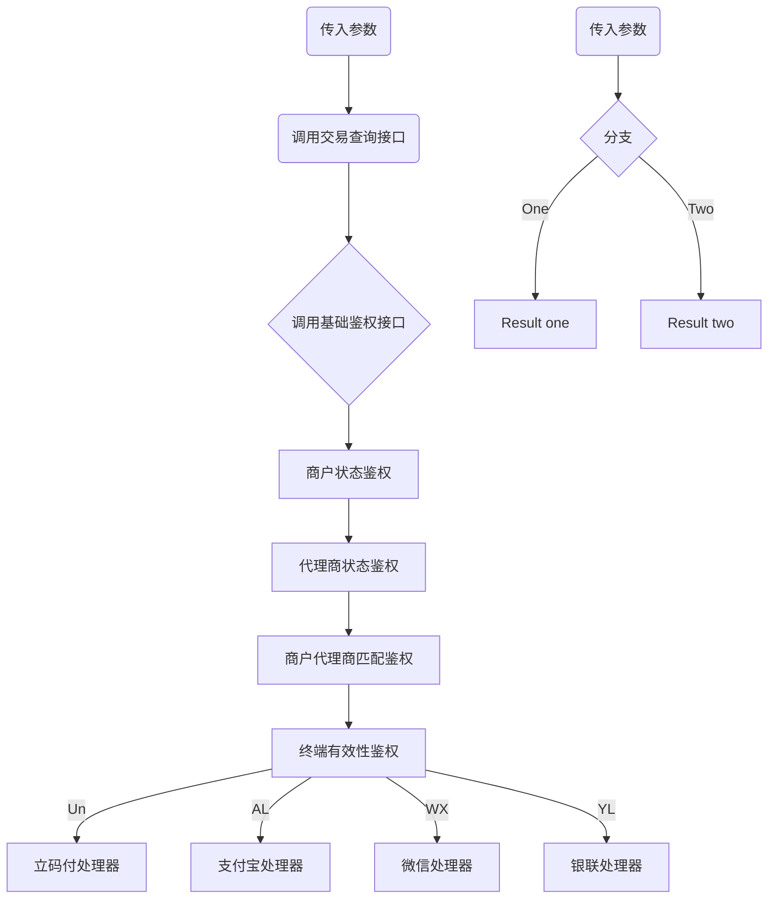

# 联动服务商API接入文档





```sequence
title: 时序图
participant 前置服务 as a
participant 核心服务 as b
participant 鉴权服务 as c
participant POSP as d

a -> b: 调用交易查询接口
b -> c: 调用商户鉴权接口
c -> c: 商户状态鉴权
c -> c: 代理商状态鉴权
c -> c: 商户代理商匹配鉴权
c -> c: 终端有效性鉴权
c -- b: 基础鉴权校验
b -- b: 商户订单号鉴权
```


